# Closetory

> ## 👕 가상에서 먼저 입고, 현실은 더 여유롭게!

- **서비스명**: Closetory
- **개발 기간**: 2026.01.16 ~ 2026.02.11
- **개발 인원**: 6명 (FE 3, BE 3)

 

# 목차

- [💡 기획 배경](#-기획-배경)
- [✨ 서비스 주요 기능](#-서비스-주요-기능)
- [📱 주요 화면 및 기능 소개](#-주요-화면-및-기능-소개)
- [🛠️ 프로젝트 핵심 기술](#core-tech)
- [🏗️ 시스템 아키텍처](#architecture)
- [👥 팀원 소개](#-팀원-소개)
- [⚙️ 기술 스택](#tech-stack)

 

# 💡 기획 배경

### 옷장에서 시작되는 스토리, CLOSETORY

우리는 옷이 많더라도 옷장 앞에서 어떤 옷을 입을지 고민하며 많은 시간을 소요합니다. 이러한 고민은 다음과 같은 이유에서 비롯됩니다.

- 옷장에 어떤 옷이 있는지 한눈에 파악하기 어렵습니다.
- 코디 감각이 부족하다고 느끼거나, 코디를 결정하는 데 시간이 많이 소요됩니다.

이처럼 옷을 충분히 활용하지 못해 발생하는 고민을 해결하고자, 우리는 다음과 같은 목표를 바탕으로 앱 개발을 진행하였습니다.

- 내 옷장의 옷을 한눈에 확인할 수 있도록 제공합니다.
- AI를 활용하여 코디를 제시하여 코디 고민 시간을 줄입니다.
- AI 가상 피팅을 통해 코디에 대한 확신을 높입니다.

 

# ✨ 서비스 주요 기능

### **스마트 디지털 옷장**

- 의류 등록 / 수정 / 삭제
- 계절 / 태그 / 색상 필터링 조회
- 사용자별 의류 데이터 관리

### AI 기반 코디 추천

- 사용자의 옷장 기반 코디 추천
- 추천 결과에 대한 이유 설명 제공
- 사용자의 옷장, 체형 및 선호 데이터를 반영한 개인화 코디 추천

### 가상 피팅

- 사용자의 체형 정보 등록
- 실제 착용 전 시뮬레이션
- 코디 간 스타일 비교 기능

### 스타일 통계 분석

- 최근 30일 착용 데이터 기반 분석
- 가장 자주 입은 의류 Top 3 제공
- 태그 사용 비율 및 색상 선호도 시각화
- 데이터 기반 개인 스타일 추천 제공

### 코디 히스토리 관리

- 캘린더 기반 코디 기록 저장
- 날짜별 코디 조회 기능
- 의류별 착용 이력 관리

### 스타일 커뮤니티

- 데일리 코디 게시글 작성 / 수정 / 삭제
- 좋아요 및 다른 사용자의 아이템 저장 기능
- 최신순 / 인기순 정렬

 

# 📱 주요 화면 및 기능 소개

### 1. **메인 화면**

  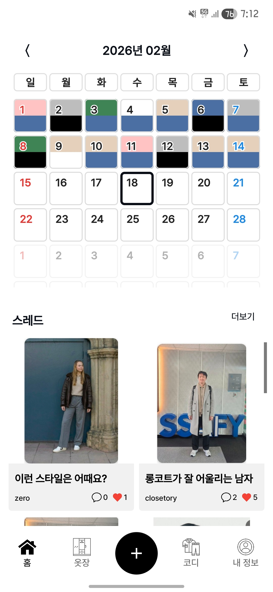
  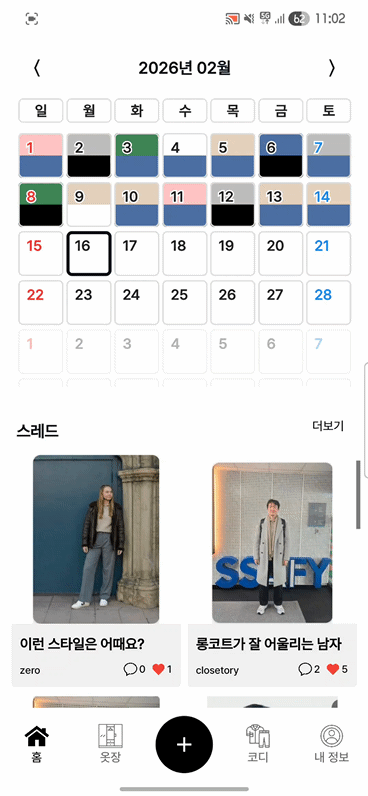

- 상단에서 등록한 룩을 날짜별로 확인할 수 있습니다.
- 각 날짜에는 룩의 상·하의 색상이 함께 표시되어 직관적으로 파악할 수 있습니다.
- 메인 화면 하단에서는 최근 스레드를 한눈에 확인할 수 있습니다.

### 2. **옷장**

  
  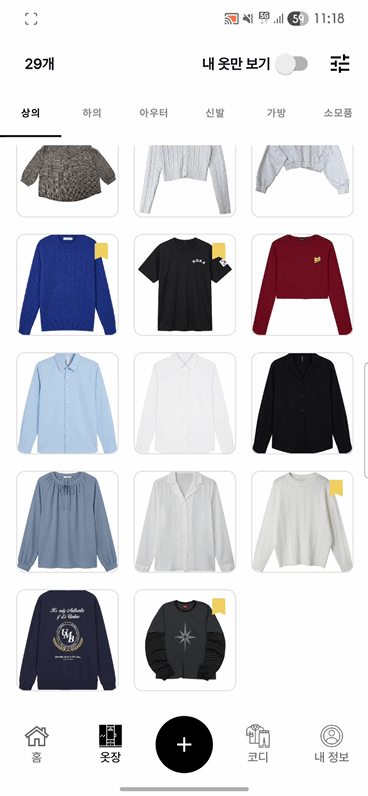
  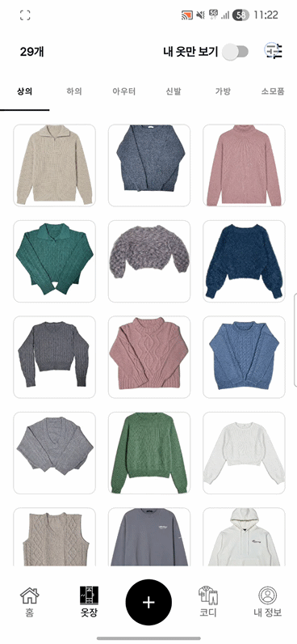

- 옷 타입별로 한 눈에 볼 수 있습니다.
- 북마크 표시로 내 옷과 스레드에서 가져온 옷을 구분할 수 있습니다.
- 다양한 필터링 기능을 통해 찾고자 하는 옷을 빠르게 찾을 수 있습니다.

### 3. **옷**

  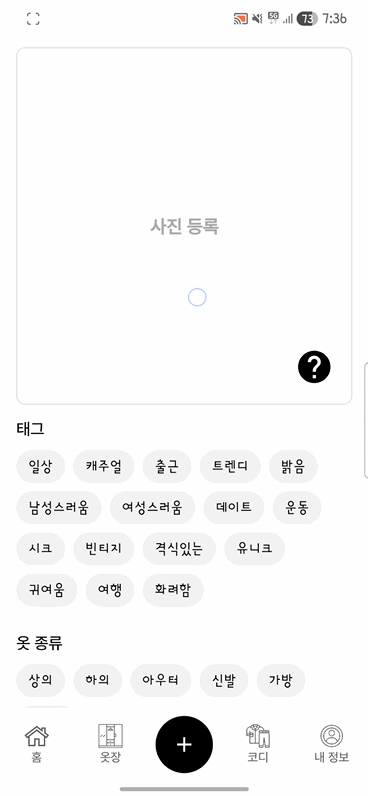
  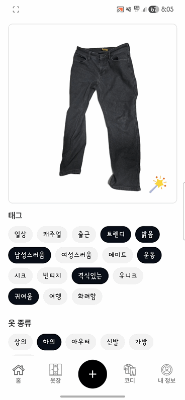
  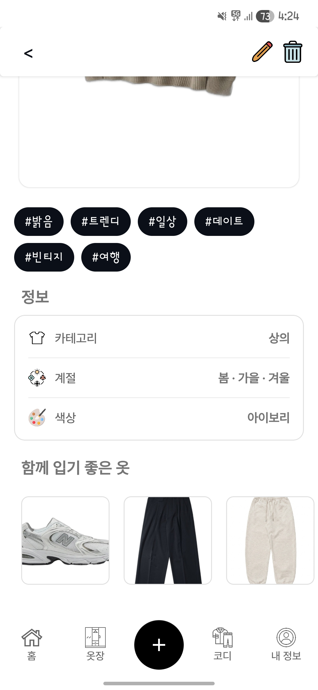

- 카메라 촬영 / 갤러리 선택을 통해 옷을 등록할 수 있으며, 자동으로 배경을 제거해줍니다.
- 배경 제거된 이미지를 보정하여 옷의 주름을 자연스럽게 개선하는 기능을 제공합니다.
- 옷 상세 페이지에서는 태그를 기반으로 '함께 입기 좋은 옷'을 추천해줍니다.

### 4. **코디**

  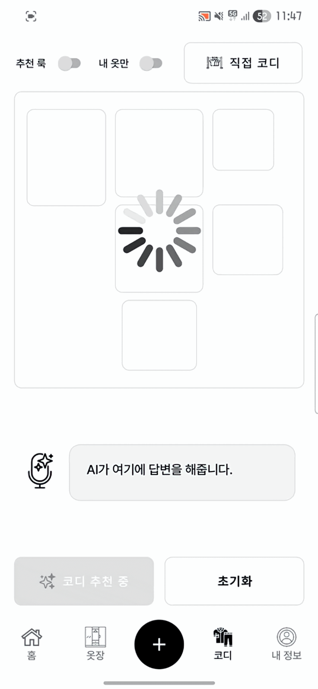
  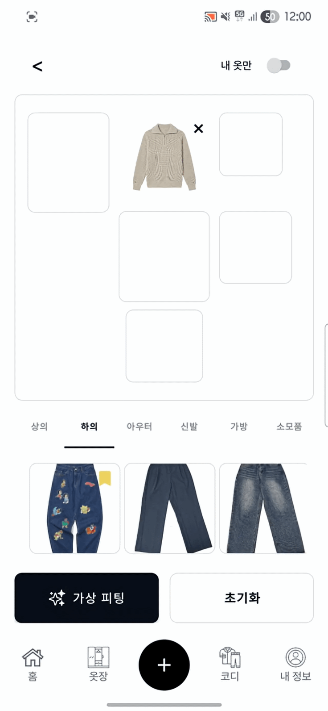

    
- AI가 '추천 룩' 혹은 '선호 룩'을 추천해줍니다.
    - 추천 룩: 사용자의 체형·스타일 정보를 기반으로, 사용자에게 잘 어울리는 룩을 AI가 추천합니다.
    - 선호 룩: 사용자의 취향과 선호 패턴을 분석해, 사용자가 좋아할 만한 룩을 AI가 추천합니다.
- 직접 내 옷장의 옷들의 조합을 비교해볼 수 있습니다.

### 5. **가상 피팅**

- 'AI 추천 결과' 혹은 '직접 코디한 룩'을 사용자의 전신 이미지에 합성하여 가상 착용을 제공합니다.

### 6. **마이페이지**

  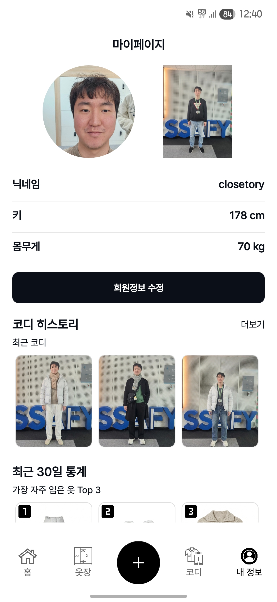
  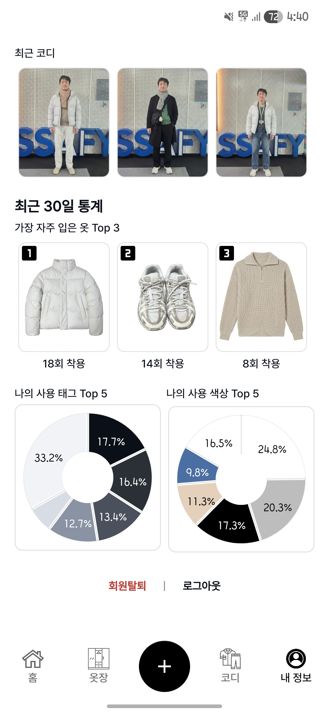

- 프로필, 전신 사진, 닉네임 등 회원정보를 수정할 수 있습니다.
- 가상피팅한 결과들을 확인하거나 캘린더에 등록할 수 있습니다. ('입었던 옷' 혹은 '입을 옷')
- 최근 한 달 간의 등록된 코디를 바탕으로 통계를 제공해줍니다.

### 7. **스레드**

  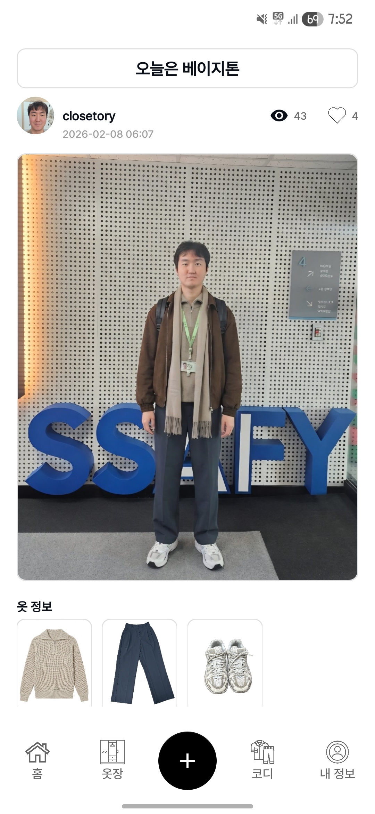
  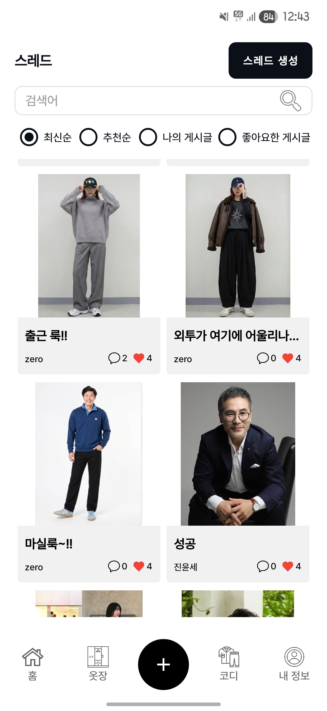

- 스레드 페이지에서 전체 스레드를 확인하고, 필터 기능을 통해 스레드를 분류해 볼 수 있습니다.
- 스레드 상세페이지에서는 사용자가 업로드한 스레드와 전신 사진에 포함된 옷 정보를 함께 확인할 수 있습니다.

 

# 🛠️ 프로젝트 핵심 기술

### 비동기

- AI 가상 피팅은 처리 시간이 긴 작업 특성을 고려해, **Coroutines**와 **viewModelScope**를 적용한 비동기 구조로 설계했습니다.
- 메인 **Thread Blocking**을 방지하고, 요청 진행 중에도 화면이 멈추지 않는 안정적인 사용자 경험을 제공했습니다.

### 가상 피팅

- 단순히 옷을 덧입히는 것이 아닙니다. 입력된 키와 몸무게로 **BMI 기반으로 체형**을 재구성합니다.
- 이를 **Nano Banana Pro** 엔진이 연산하여, 어떤 자세에서도 왜곡 없는 완벽한 착용감을 시각화합니다.

### 자동 태그 선택

- **자동 태그 선택 기능**은 **ML Kit Image Labeling**의 On-Device 추론을 활용해 이미지에서 **객체 라벨**을 추출하고, **신뢰도 기준**을 만족하는 태그만 자동으로 선택하도록 구현했습니다.
- **자동 색상 선택 기능**은 의류 영역의 **평균 색상 값을 분석**해 사전 정의된 **색상 팔레트와 비교함**으로써, 실제 의류 색상에 **가장 근접한 값**을 안정적으로 선택하도록 구현했습니다.

 

# 🏗️ 시스템 아키텍처

 

# 👥 팀원 소개

<table>
  <tr>
    <td align="center">
      
    </td>
    <td align="center">
      
    </td>
    <td align="center">
      
    </td>
  </tr>
  <tr>
    <td align="center">
       
      <a href="https://github.com/JinYunSe">진윤세</a>
    </td>
    <td align="center">
       
      <a href="https://github.com/basicprogram">오우택</a>
    </td>
    <td align="center">
       
      <a href="https://github.com/choiinho97">최인호</a>
    </td>
  </tr>

  <tr>
    <td align="center">
      
    </td>
    <td align="center">
      
    </td>
    <td align="center">
      
    </td>
  </tr>
  <tr>
    <td align="center">
       
      <a href="https://github.com/hjoo830">황효주</a>
    </td>
    <td align="center">
       
      <a href="https://github.com/Zerozero212">김경민</a>
    </td>
    <td align="center">
       
      <a href="https://github.com/zzaem-zzang">육재민</a>
    </td>
  </tr>
</table>

 

# ⚙️ 기술 스택

### Frontend

  
  
  
  

### Backend

  
  
  
  

### AI

  
  

### Infra

  
  
  
  
  

